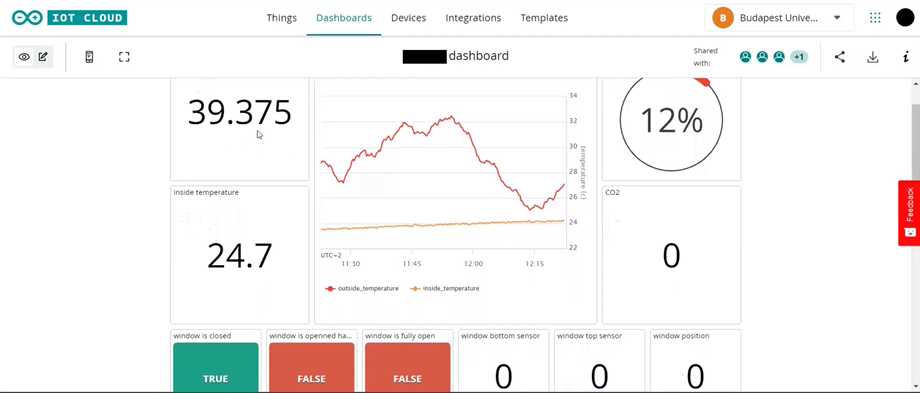
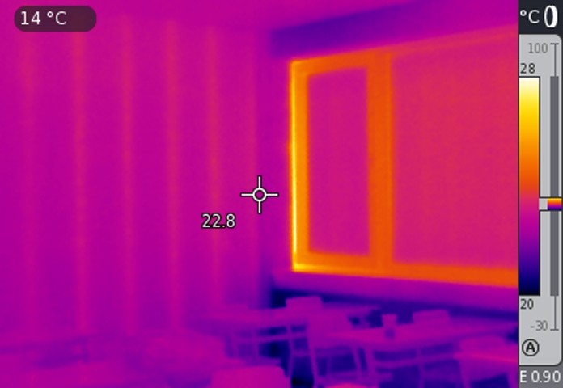

# **Educational Room Measurement System**

An educational room belonging to the Budapest University of Technology and Economics (BME) has been studied for tracking the physical quantities of temperature, humidity, and quality of air.
The project has started with installing sensors inside the rooms and in different places. Different kind of sensors have been used including temperature, humidity, avoid, photoresistor, laser emitter, analog CO2 gas, LED, and buzzer.
Opla, which is an outside temperature device, has been installed initially that allows to compare its values with the data generated by the sensors.
These sensors are wired and then connected to Arduino MKR Wi-fi 1010 boards with the aid of bread board and Arduino UNO R3.
After implementation the system has been started and tested. To save the data measured by the sensors, Arduino cloud has been used where real-time data was being stored.
The system consists of 3 phases, occurring at the same time:
1.	Starting the system. The system starts when the board is plugged to electricity. 

2.	Measuring. In this stage, each sensor starts taking recordings for each physical quantity.

3.	Storing data. Once the sensors start taking recordings, the data are stored in the cloud and graphical visualization has been initiated.

These stages can be accessed at anytime and without any prior order only if there is data stored 
in the database.

### **Data Analysis**

The data stored by the sensors in the cloud has been extracted to CSV files. For data analysis, Google Collab has been chosen. It consists of Jupiter notebook using Python. Some useful packages are used in the project like pandas, matplotlib, NumPy, seaborn and computer vision.
The following steps for data analysis are as follow:

**•	Creating Data Frame**

The data frames have been created based on the csv measurement files. They are stored inside the notebook environment.

**•	Cleaning Data**

Some data are irrelevant. The outliers and big jumps value are removed from the data frame.

**•	Optimizing Data**

Due to huge amount of data, the size of dataset has been reduced instead of visualizing data every second. The data will be displayed every one minute, and the value will be the average over this period.

**•	Visualizing Data**

The data are presented in graphical representation. They are plotted using various types of graphs with legends.

## **Thermal Prediction**
The computer vison package has been used to predicts the location of highest degree temperature in a thermal picture.

